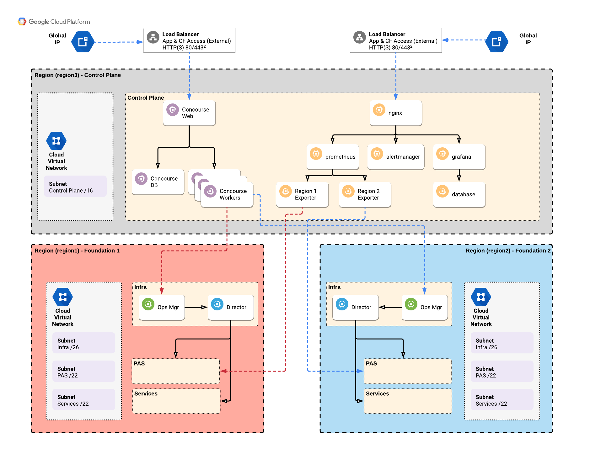
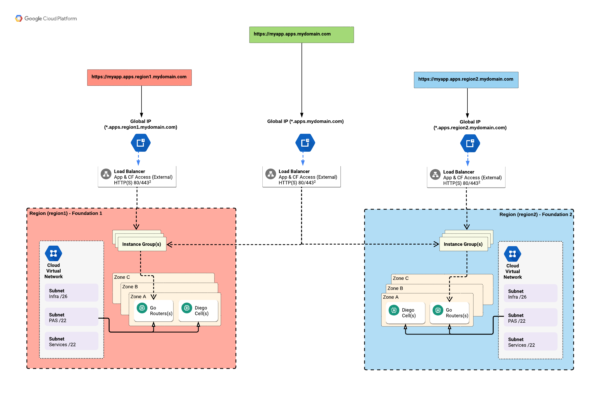
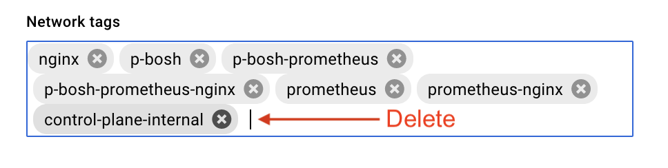
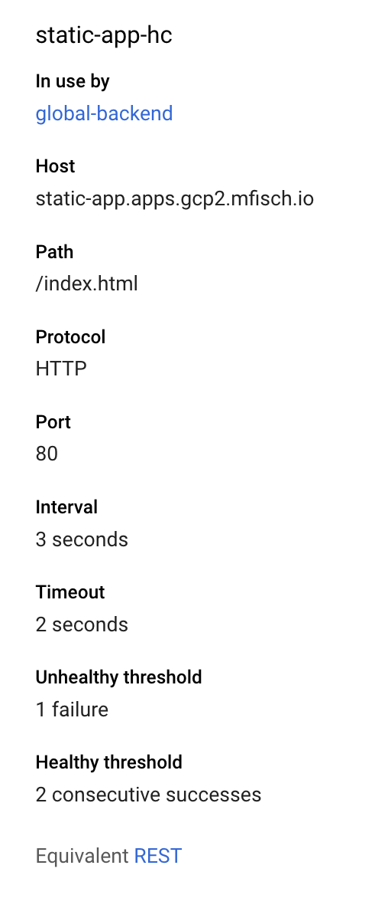
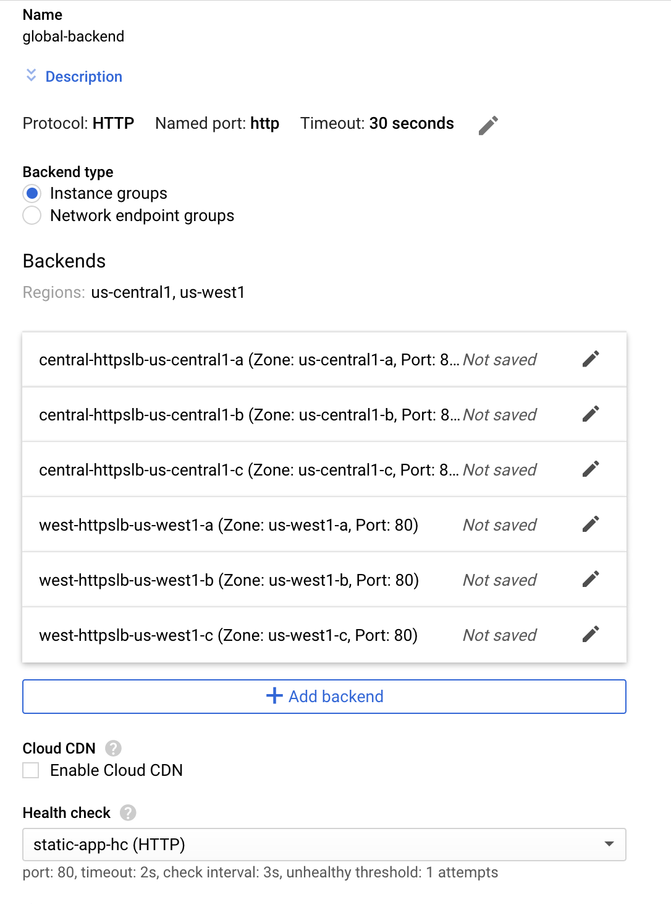
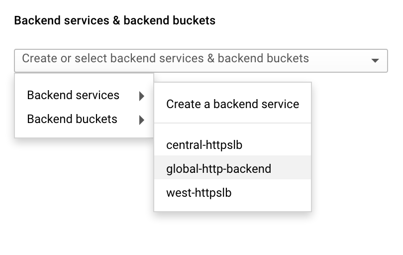
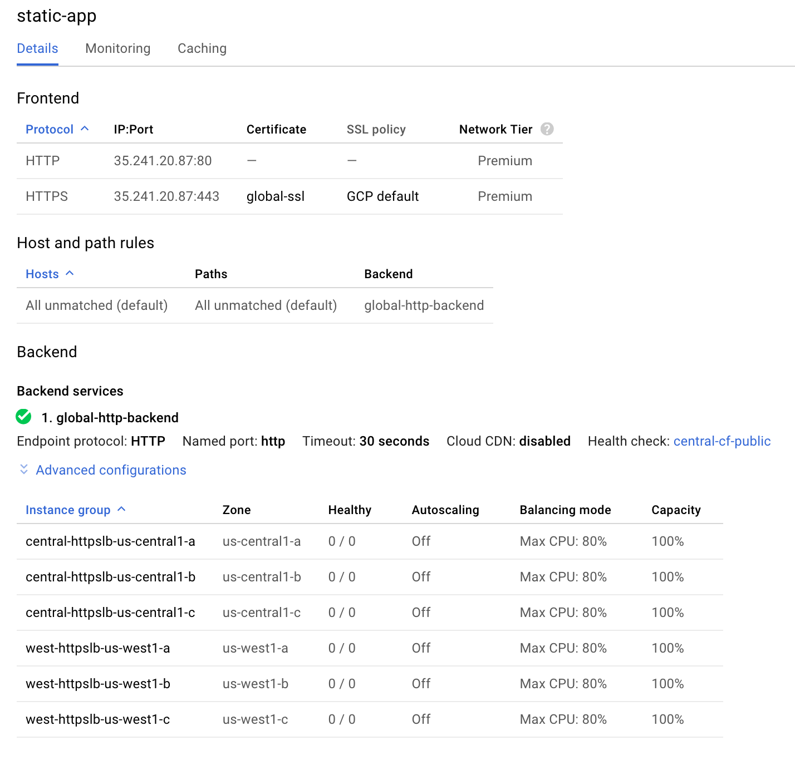
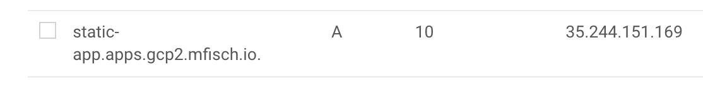

# GCP Multi-Region Reference Arch

Reference architecture for an automated PCF install on GCP using the new PCF automation resources. This repo includes steps for deploying multiple foundations across multiple regions and then deploying an app that can be globally load balanced across both regions. It *is possible* to use this repo as steps for deploying a single foundation in a single region by eliminating the second region. The following pieces are not multi-region specific and should be a good reference component for GCP in any design: Concourse, Prometheus, the Automation Pipeline.

Note: This repo references multiple outside repos and does not attempt to recreate all the documentation for those repos, nor does it try to automate all of them into one step.

## Architecture Diagram

There are two architecture diagrams that show the deployment.

The first one shows the overall design with two foundations (zoomed out) along with the control plane, highlighting Concourse and Prometheus. This is not meant as a replacement for the individual PCF, Concourse, or Prometheus diagrams and instead inteads to simply show the relationships.



The second diagram shows how applications are accessed via load balancers when there is a globally balanced application across multiple regions.




## Requirements

1. Access to the [beta PCF automation code](https://docs.pivotal.io/pcf-automation/release/index.html)
2. A [control plane concourse deployment](https://github.com/pivotal/control-plane) with credhub
3. Terraformed GCP environment(s) using [terraforming-gcp](https://github.com/pivotal-cf/terraforming-gcp) - see section below for more details.
4. For user/org/quota management - [cf-mgmt](https://github.com/pivotalservices/cf-mgmt) is recommended.


### Terraform Requirements

#### External Databases

The pipeline is written assuming that you are using external (GCP) Cloud SQL rather than internal. This requires that you set **external_database = true** in your tfvars file. This does **not** apply to Credhub which cannot use external DB currently due to certificate issues. If external databases are not desired changes will be needed in the `pipeline-params.yml` and `cf.yml` files.

#### Terraform Does Not Create Opsman

In order for the automation pipelines to more easily manage the Opsman VM without fighting with the terraform, these pipelines require that you disable Opsman VM creation in the terraform scripts. This is done by setting **opsman_vm = false** in the tfvars file. This also requires a checkout of the terraform code from Nov 28 2018 or later.

*Note: A state bucket and state files will need to be created later in order for the automation to track the state of the OpsMan VM. Details are below.*

#### Multiple Regions

If multiple regions are desired, then some extra work is required in the terraform setup. This section is *not meant* to replace the [README](https://github.com/pivotal-cf/terraforming-gcp) from terraforming-gcp, so please also reference that doc.

For multiple regions, you will need to use seperate and distinct tfvars and tfstate files when deploying terraform. The general process is as follows:

- Create a tfvars.region1 file. This should include all the stuff from the README and **external_database = true** as noted above. Your certificates should have SANs for the regional endpoints (\*.apps.sys.central.gcp.mfisch.io) and a global endpoint (*.apps.sys.gcp.mfisch.io). For example, your cert config file should include SANs like this:

```
[ alt_names ]
DNS.1 = *.apps.gcp.mfisch.io
DNS.2 = *.sys.gcp.mfisch.io
DNS.3 = *.login.sys.gcp.mfisch.io
DNS.4 = *.uaa.sys.gcp.mfisch.io
DNS.5 = *.apps.central.gcp.mfisch.io
DNS.6 = *.sys.central.gcp.mfisch.io
DNS.7 = *.login.central.sys.gcp.mfisch.io
DNS.8 = *.uaa.central.sys.gcp.mfisch.io
```

*Note: A set of certificate helper scripts and configs are available which will generate a CA Key & CA Cert (PEM-format), and Regional CSRs, Keys, Certs (PEM-format), and PEM-formatted Keys (which credhub requires). These are available in the `certs` folder*

- Copy this regional tfvars file to tfvars.region2. You will need to modify the certifcates and the region/az names. Generally `%s/region/region2/g` along with changing the certs will suffice. You can re-use the service account that you used for region1.

- Run the terraform apply. You will need to specify the output and vars files as follows (using `west` and `central` as example regions). If you want to be less yolo, change apply to plan and/or remove --auto-approve.

```
terraform init
terraform apply -state=tfstate.region1 -var-file=terraform.tfvars.region1 -auto-approve
terraform apply -state=tfstate.region2 -var-file=terraform.tfvars.region2 -auto-approve
```

## Pipeline Setup & Usage

#### Required Manual GCP Steps - State File & Bucket

The pipeline tracks OpsMan VM state using a state file. These files are stored either in git or GCS (or S3). This example pipeline uses GCS. There is manual setup required for this. Manually create a versioned Google Cloud Storage bucket to store the state files. Then you need to manually create a state file for each opsman that you intend to build. The filename needs to be OPSMAN_NAME.state. 

For example:

```
gsutil mb gs://gcp-mr-state-mfisch-west
gsutil versioning set on gs://gcp-mr-state-mfisch-west
touch state.yml
gsutil cp state.yml gs://gcp-mr-state-mfisch-west
```

**This step must be repeated for every region/opsman you plan on creating**

### Required Credhub Variables

In order to set the variables in the correct Credhub (the one deployed with Concourse), it is necessary to run the `./target-concourse-credhub.sh` script from your `control-plane` folder.

The following variables must be set in the concourse credhub that was deployed earlier (using `west` as an example for a region and team.

- /concourse/west/storage\_account_key - `terraform output pas_blobstore_gcp_service_account_key`
- /concourse/west/db_password - `terraform output pas_sql_password`
- /concourse/west/uaa_pem - PAS certs
- /concourse/west/credhub\_key\_encryption_password
- /concourse/west/pivnet_token
- /concourse/west/git\_private_key
- /concourse/west/opsman_password
- /concourse/west/opsman_decryption_passphrase
- /concourse/west/state_bucket_key - `gcp service account key that can talk to the state bucket`
- /concourse/west/opsman_service_account_json - `terraform output opsman_service_account_key`

If you have more than one region you will need to repeat the settings for each one. **1 Region in GCP = 1 Team in Concourse**

### Required Config Changes

- **All** the files under `/environments` require changes that will be specific to your deployment. Change these before flying the pipelines and commit and push them to git.

- The pipeline itself should be usable without any changes.

### Concourse Setup

From the **control-plane** folder, where you deployed Concourse, login to Concourse using the **main** team. The URL will be https://concourse.dns_name_in_terraform/ or simply as follows:

`fly login -t main -c https://$(terraform output concourse_dns) -k -u admin -p $(terraform output concourse_password) -n main`

After authenticating into Concourse, Create a team(s) in concourse that matches the region(s) you want to deploy into.

`fly set-team -t main -n west --local-user=admin`

Login to the new team:

`fly login -t west -c https://$(terraform output concourse_dns) -k -u admin -p $(terraform output concourse_password) -n west`

Fly the pipeline(s)

`fly set-pipeline -t west -c gcp-pas-pipeline.yml -p install-pcf -l environments/west/pipeline-params.yml`

## Deploying Prometheus

Prometheus is deployed using the [Prometheus-MVP repo](https://github.com/pivotalservices/prometheus-mvp). This repo natively supports monitoring multiple foundations. Prometheus should be deployed to the control-plane bosh director, alongside concourse. The following changes are needed to make it work for this setup:

1. In prometheus.sh, add the `nginx-public-ip.yml` ops file so that you can reach Prometheus, Grafana, and Alert Manager.
2. If you plan on setting up a multi-region application later on, you can add the endpoints to the `probe_endpoints` list in `prometheus-params.yml`
3. Some features in prometheus.sh need to be added or removed at your discretion (ie. slack). This is my example file for reference:

```
11:00 $ cat prometheus.sh
set -e
bosh -n -d prometheus deploy prometheus.yml \
     -o ops/monitor-http-probe.yml \
     -o ops/prometheus-config-ops.yml \
     -o ops/prometheus-exporter-ops.yml \
     -o ops/nginx-public-ip.yml \
     -o ops/enable-bosh-uaa.yml \
     --vars-store prometheus-params.yml 
```

Note, if you want to store prometheus creds in the Control Plane bosh director's credhub, change `--vars-store` to `--vars-file`.

After Prometheus is deployed a firewall change is needed. 

Create a new firewall rule in GCP called `nginx`. It should allow inbound TCP connections from 0.0.0.0/0 to ports 3030, 9090, and 9091 and use the target tag `nginx`.


**IMPORTANT**: You will not be able to reach the nginx server unless you remove the network tag called `control-plane-internal`. This can be done by finding the nginx VM and clicking the Edit button and then removing the tag, and then click Save.



Note: As an alternative to giving the nginx host a public IP you could deploy a load balancer, the firewall rules are still needed.

For your convenience you may want to make a DNS record that points to the nginx server's public IP (or the Load Balancer IP) in the control-plane hosted zone.

## Setting Up a Multi-Region Application

In order to deploy a multi-region application it must first be deployed once in each region. Then mapped to a global shared domain and a load-balancer connected to the global shared domain. We must also create a GCP load balancer and DNS record.

### Deploying the Application and Domain (cf)

Any application should work in this manner but for simplicty we are deploying a static web application, the applications can be found in the `central-app` and `west-app` folders.

**Repeat these steps for each region/foundation:**

After logging into the foundation, we deploy the sample application:

```
cd apps
cd central-app
cf push -b staticfile_buildpack static-app
```

Next we create a shared global domain that will be served by the Load Balancer previously created and map that route to the application.

```
cf create-shared-domain apps.gcp.mfisch.io
cf map-route static-app apps.gcp.mfisch.io -n static-app
```

### Configuring the Global Healthcheck

In the **Compute Engine** menu, locate **Health Checks**. Create a healthcheck, the name used here is *static-app-hc*. The critical part here is to click on **More** and enter a host check. In this field we put the global app name which we previously setup, for example **static-app.apps.gcp.mfisch.io**.

**NOTE** Although you can create a new healthcheck during the backend creation process, you **CANNOT** put a host header on the healtcheck from that menu. You **MUST** go in via the Compute Engine menu to create this health check.



### Configuring the Load Balancer/DNS

In GCP we need to create a Load Balancer which load balances against `all` the Diego Cells in both regions. You can create this using http or https. Google has made backend creation *difficult to find* so here's the process.

#### Create the Global Backend

1. Navigate to the `Load Balancing` page, and at the bottom click on `advanced menu`.
2. Click on `Backend Services`
3. Click `Create Backend Service`
4. In the backend service you need to add in *every gorouter instance group from both regions*.
5. For the healthcheck, use the previously created healthcheck.



#### Create the Global Load Balancer

###### Create the Backends

1. Navigate back to `Load Balancing` and click `Create Load Balancer`. 
2. Choose http/https.
3. For backend, choose your newly created backend service.



###### Create the Frontends

Add the front-ends:

1. Create an http front-end. Reserve a new ephermeral IP and call it `global-cf`
2. Create an https front-end, re-use the same IP from above.

###### Finish Creation

Click the create button. 

Your LB will look like this when finished:



#### Create the DNS Record

After the LB is created we need to create a an A record that points to the load balancer that setup. The hostname needs to match the app name from the app route that you deployed.  In my setup, `gcp.mfisch.io` is my global domain, and so I create an A record in that Zone that points to the `global-cf` IP reserved above.




### Testing

Once this is done we can now reach our application either via the regional (direct) url, or via the Global URL. Since GCP load balancing using anycast, you will not see any round-robin behavior, you will always see the same application return back unless you inject a problem into a region.

The simplest way to inject an issue is to stop the gorouter service on some of the gorouters, this can be done from the regional OpsMan using `bosh ssh`.

```bosh ssh router -c "sudo /var/vcap/bosh/bin/monit stop gorouter"```


### Monitoring Multi-Region Applications

The dashboard file `App-Error-Budget.json` in the `dashboards` folder provides a good example of monitoring an application regionally and globally, with an SLO. This can be imported into Grafana using the Import feature using this process.

1. Ensure that you've added your application to the `probe_endpoints` as mentioned in the Prometheus section.
2. Import the dashboard into Grafana
3. Edit the charts to point to your target(s). The dashboard is hardcoded with some example targets.

## cf-mgmt

cf-mgmt has directions in it's own repo, only a few changes were made for this deployment.

- Pipeline/task tweaks
  - cf-mgmt is designed to live in it's own repo, but we injected it here so some paths were changed
  - no LDAP integration was done so the LDAP related items were removed
  - PASSWORD references were also removed since we're using client secrets
  - the `client_secret` variable was renamed to `cf-mgmt-secret` because it's easier to understand what it's used for in credhub.
- Two variables were set in credhub because they were either secret or different per foundation. They are
	- system_domain - set to sys.regionX.gcp.mfisch.io in this example
	- cf-mgmt-secret - secret of the created uaac client per foundation
- Two local users were created `matt` & `joe`

Note: cf-mgmt cannot create local users. If you are backing to LDAP or SAML it will create these for you, but in this example we are just using local users, so they need to manually be created for this example.

```
cf create-user matt <password>
cf create-user joe <password>
```


## Known Issues & Limitations

- There is no automation for the global load balancer setup.

- In GCP the automation cannot add an ssh key at build-time. The supported way to ssh into the opsman is to add a key via the console or use ssh from the console in the same manner.

- The terraforming-gcp repo does not create Cloud NAT, so all the PCF VMs have external IPs. When this feature is added the configs should be modified to use only private IPs (`internet_connected: false`)
